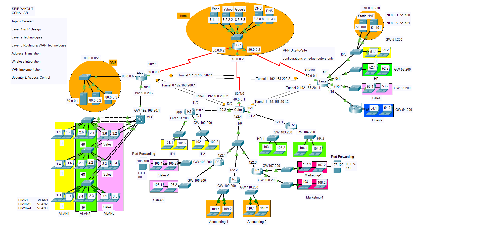

# CCNA Network Simulation Project: A Comprehensive Hands-On Refresh of Core Networking Concepts

## Project Scope and Key Implementations

This project simulates a fully functioning network, focusing on both Layer 2 and Layer 3 technologies, along with advanced configurations such as security measures, WAN connectivity, and VPN setups. The network setup consists of routers, switches, hosts, and various configurations, all within Cisco Packet Tracer.

## Network Diagram

## Layer 1: Physical Layer

    Network Devices:

        Configured Switches, Routers, and Hosts to represent an enterprise network.

        Proper cabling techniques applied for Ethernet, fiber, and serial connections.

    IP Addressing:

        IPv4 addressing scheme implemented, with subnetting for multiple subnets across the network.

## Layer 2: Data Link Layer

    Dynamic Trunking Protocol (DTP):

        Configured DTP on trunk ports to allow automatic negotiation of trunk links between switches.

    VLAN Trunking Protocol (VTP):

        Used VTP in transparent mode for the efficient propagation of VLAN information across switches.

    VLAN Configuration:

        Created multiple VLANs for separating broadcast domains and assigned them to the appropriate switch ports.

    Spanning Tree Protocol (STP):

        Configured STP for loop prevention, with the selection of root bridge to ensure redundancy without network loops.

    EtherChannel:

        EtherChannel implemented between switches using LACP to provide higher bandwidth and redundancy.

    Port Security:

        Configured port security on access ports to limit device access by MAC address and prevent MAC flooding attacks.

    DHCP Snooping:

        Enabled DHCP Snooping to protect the network from rogue DHCP servers and enforce trusted DHCP relay agents.

## Layer 3: Network Layer

    Inter-VLAN Routing (MLS):

        Used Layer 3 switches for Inter-VLAN Routing, enabling communication between different VLANs through routing interfaces.

    DHCP Configuration:

        Configured DHCP and DHCP Relay to automatically assign IP addresses to hosts in different subnets.

    Access Control Lists (ACLs):

        Created ACLs to filter traffic based on source and destination IP addresses, providing security and traffic management.

## WAN Technologies

    PPP (Point-to-Point Protocol):

        Configured PPP for WAN connectivity between remote sites with proper authentication using PAP and CHAP.

    Network Address Translation (NAT):

        Implemented Static NAT, Dynamic NAT, and PAT for efficient IP address management between internal and external networks.

    Port Forwarding:

        Configured port forwarding to allow external access to internal services (e.g., web servers, FTP servers).

## Wireless Technologies

    Configured wireless routers and access points, providing Wi-Fi connectivity across the network with appropriate security settings (WPA2).

## VPN Technologies

    Site-to-Site VPN:

        Established a site-to-site VPN to provide secure communication between two remote locations using IPSec encryption.

Security Measures

    Access Control Lists (ACLs):

        Implemented ACLs for traffic filtering at both the router and switch levels, enhancing security by controlling inbound and outbound network traffic.

    Port Security and DHCP Snooping:

        Ensured that only authorized devices could connect to the network by enforcing port security and DHCP snooping.

## Conclusion

This hands-on project has allowed me to revisit and solidify key CCNA concepts in a practical, real-world network design. It has given me the confidence to apply these skills in any enterprise network environment, enhancing my proficiency as a network professional.

Whether you're a CCNA student revisiting the basics or an experienced network engineer looking for a quick refresher, I hope this project proves to be a valuable resource for understanding the fundamental concepts that power modern networking.
